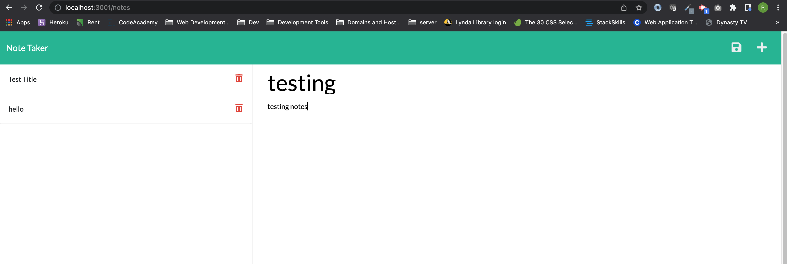

# Note Taker

## Description

This is an application which allows you to create new notes and post them into the json db file.

## Table of Content

- [Installation](#installation)
- [Usage](#usage)
- [Heroku](#heroku)
- [GitHub](#github)
- [Screenshot](#screenshot)

## Installation

- Git clone the application
- Run $npm install

## Usage

This application is used to create notes.

## GitHub

Repo Url - https://github.com/rpliszka1987/miniature-eureka

## Heroku Url

https://drive.google.com/file/d/1EWsbOSpQBFnZDnE7lON2TV6-uCKZv1fE/view

## Screenshot

